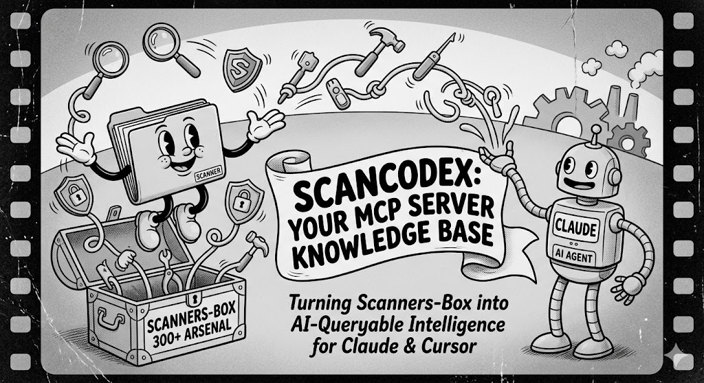
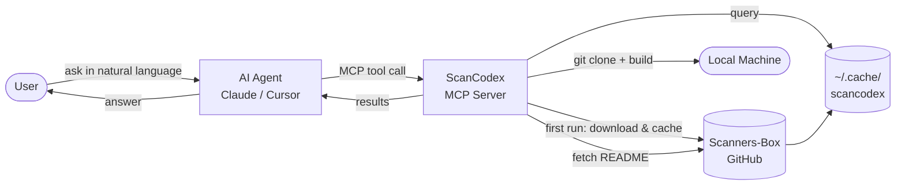

# ScanCodex

[中文文档](README_CN.md)



> The security scanner codex for AI agents — powered by [Scanners-Box](https://github.com/We5ter/Scanners-Box).


An MCP (Model Context Protocol) server that turns the Scanners-Box arsenal of 300+ open-source security tools into a queryable knowledge base for Claude, Cursor, and any MCP-compatible AI agent.

Ask your AI assistant _"what should I use to scan Kubernetes for misconfigs?"_ and it will consult the codex, recommend the right tools, show you how to install them, and even run the install for you.



## Tools exposed

| Tool | Description |
|------|-------------|
| `list_categories` | Browse all 20 scanner categories |
| `recommend_scanners` | Find scanners by task description, category, or language |
| `build_workflow` | Get a full tool chain for a pentest phase |
| `get_tool_usage` | Fetch install & usage instructions from a tool's GitHub README |
| `install_tool` | Clone and install a tool locally with one command |

## Quick start

**Prerequisites:** Python 3.10+

```bash
git clone https://github.com/We5ter/ScanCodex
cd ScanCodex
pip install .
```

Scanners-Box data is **downloaded automatically** on first use and cached to `~/.cache/scancodex/`. No extra cloning needed.

## Claude Desktop setup

Add to `~/Library/Application Support/Claude/claude_desktop_config.json`:

```json
{
  "mcpServers": {
    "scancodex": {
      "command": "python3",
      "args": ["-m", "scancodex.server"]
    }
  }
}
```

## Claude Code setup

```bash
claude mcp add scancodex -- python3 -m scancodex.server
```

## Example prompts

```
What tools should I use to test an LLM app for prompt injection?

I need to scan a Kubernetes cluster for security issues — what do you recommend?

Build me a recon workflow for a pentest engagement.

Show me Go-based vulnerability scanners for container images.

How do I install and use GitHack?

Install subfinder for me.
```

## Pentest phases for build_workflow

`recon` · `vuln_scan` · `web` · `container` · `mobile` · `smart_contract` · `ai_apps` · `malware` · `code_analysis` · `incident` · `a3c`

## License

MIT — data sourced from [Scanners-Box](https://github.com/We5ter/Scanners-Box) (CC-BY-NC-ND-4.0).
